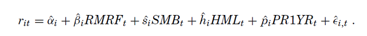
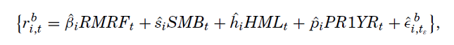

# Replicate_Kosowski-Timmermann-Wermers-and-White-2006

## The paper: 

[Kosowski, R., Timmermann, A., Wermers, R. and White, H. (2006), Can Mutual Fund “Stars” Really Pick Stocks? New Evidence from a Bootstrap Analysis. The Journal of Finance, 61: 2551-2595.](https://www.researchgate.net/publication/4913482_Can_Mutual_Fund_Stars_Really_Pick_Stocks_New_Evidence_from_a_Bootstrap_Analysis)

## Synopsis
The paper wants to test whether the estimated four-factor alphas of “star” mutual fund managers are due solely to luck or to genuine stock-picking skills.

In particular, it examines the statistical significance of the performance & performance persistence of the “best” and “worst” funds by a bootstrap procedure applied to a variety of unconditional and conditional factor models of performance.

The empirical results have shown that  the performance of these best and worst fund managers is not solely due to luck, that is, it cannot be
explained solely by sampling variability.
While the paper finds strong evidence of superior performance and performance persistence among growth-oriented funds using bootstrap tests for significance, no evidence of ability among managers of income-oriented funds. Inference using the bootstrap differs substantially from standard inference tests, especially in smaller samples of funds (or shorter time series) or among groups of funds with lower right-tail levels of performance.

## Steps 
1. Perform a standard Carhart model using Fama-Macbeth rehression with Newey-West standard error adjustments.

  
2. Prepare for the boostrap. Use the Carhart model in step 1 to compute alphas, factor loadings and residues using the time series monthly return data of all funds available in the market.

3. For each fund, draw a sample w/ replacement from regression residues in the 2nd step, create a pseudo-time series of resampled residues. In this way, a pseudo monthly excess return are constructed

4. Regress the bootstrap returns for any b on Carhart factors. The result could be a positive alpha (skills) or a negative alpha (not so good). Repeat for each fund. 1000 iteration is performed for each bootstrap.
